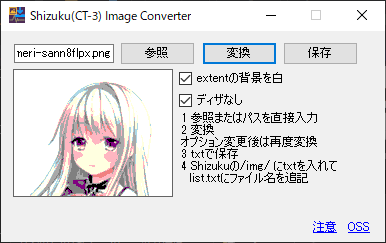

# Shizuku Image Converter
USBテスター「Shizuku/CT-3」向け画像変換ツール  

## このソフトウェアについて
まずそもそも、USBテスター向けの画像とは何か。  
ShizukuやCT-3にはLuaスクリプトの実行機能があり、
その中の画面操作で点を描くことができる。

pngやjpgの画像から色を取り出して、
その情報をLuaスクリプトで画面に並べることで、
USBテスターに画像を表示することが可能となる。

## 画像表示して何なのか
別に何か役に立つようなこともありません。
ただの遊びです。

## ビルド方法
必要物: C#(.net4.7.2)が利用可能なVisual Studio

そのままビルドすれば自動でライブラリとかがインストールされて
exeができると思います。

## 使用方法
1. exeを起動し、「参照」で用意したpng/jpgを選択。
2. 「変換」を押すと減色&縮小された画像が出てきます。  
画像によって余白の色や色境界の表現方法を変更できます。
設定を変えたら再度「変換」を押してください。
3. 「保存」を押すと入力画像と同じ場所にtxtファイルが生成されます。
これをShizukuに読み込ませると画像として表示できます。

## 注意
私はただの学生です。(2021/10時点)

このアプリケーションは画像の変換のみを行います。
Shizukuで表示するにはLuaスクリプトが必要です。
[Shizuku/CT-3用画像表示スクリプト](https://gist.github.com/ZAKI-System/2042beeb03dee9f6166cea08e3638a76)

生成されるファイルの仕様は予告なく変更することがあります。

このアプリケーションに何も保証はありません。
ShizukuやPCに不具合が起きる可能性もあります。
そこだけ注意してください。
あとできればバグ報告してください。